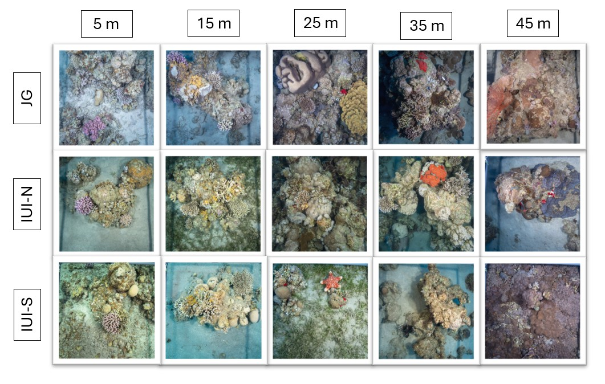

# Coral Reef Depth Dynamics in the Gulf of Aqaba/Eilat

This study explores the structure and resilience of coral reef ecosystems in the northern Gulf of Aqaba/Eilat (GoA/E), focusing on benthic community composition and coral photo-physiology across depth gradients (5–45 m). Using in situ imagery and chlorophyll fluorescence measurements, we assessed reef-building corals and other functional groups across three reef sites. Depth emerged as the primary driver of community structure, with distinct assemblages and physiological adaptations observed in shallow, intermediate, and upper mesophotic zones. Despite a major storm in 2020, hard corals showed taxonomic stability, while soft corals and Crustose Coralline Algae (CCA) varied with depth and substrate. Depth-generalist species demonstrated strong photo-acclimation, whereas specialists were confined to specific zones. The findings challenge the Deep Reef Refugia Hypothesis, suggesting limited vertical connectivity and highlighting mesophotic reefs as unique ecosystems. This work underscores the importance of continued monitoring to inform coral reef conservation strategies.

###All photoquadrat images can be found in [CoralNet] ( https://coralnet.ucsd.edu/source/4342/)

  

